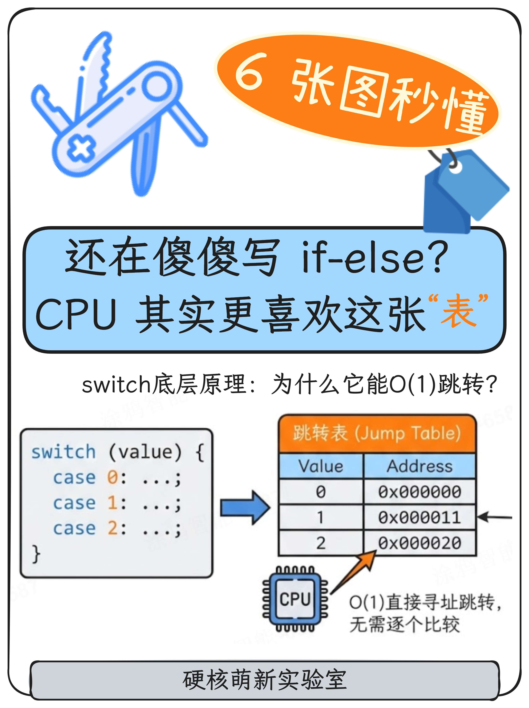
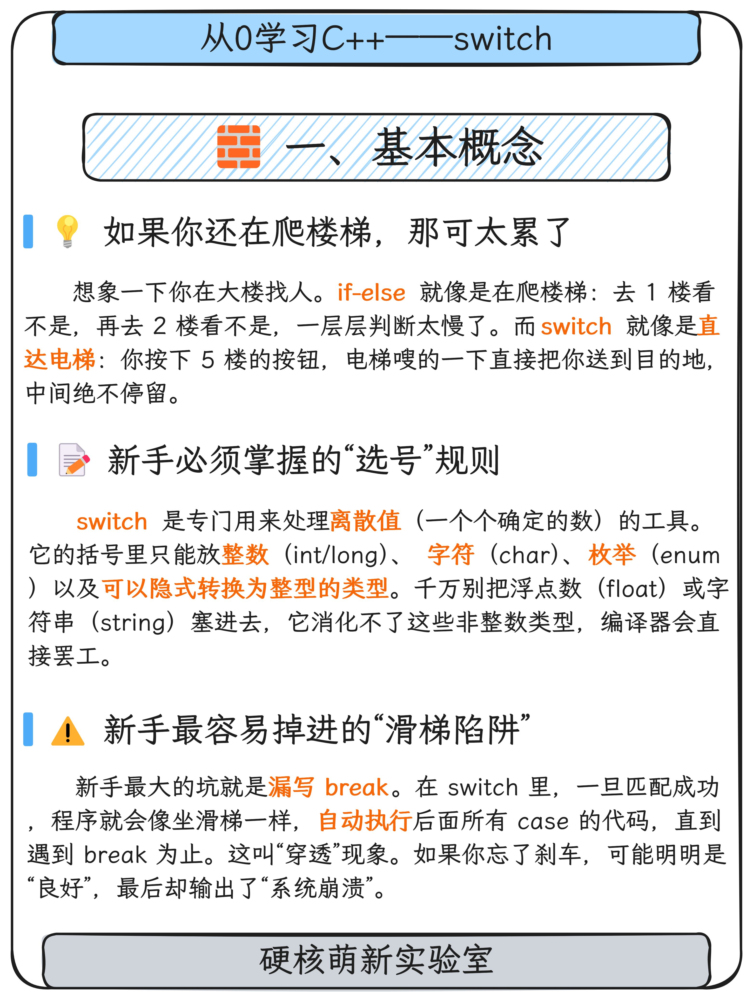
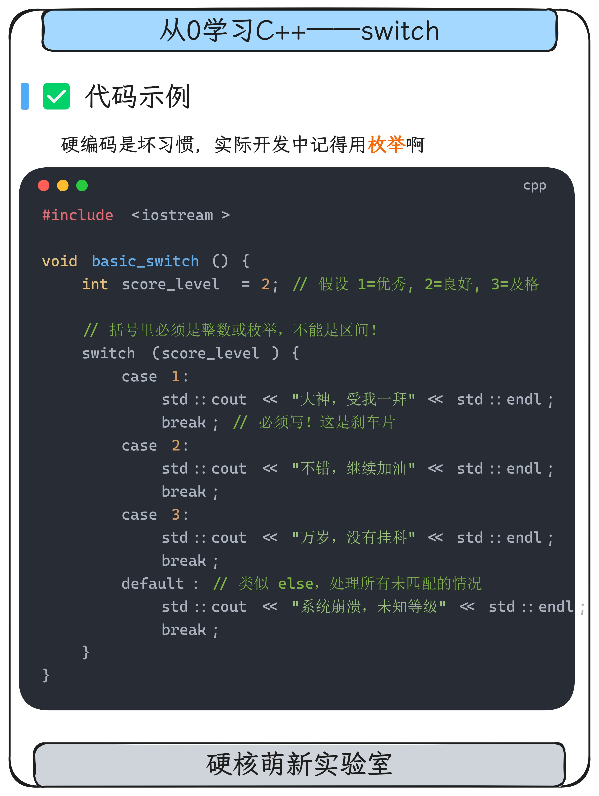
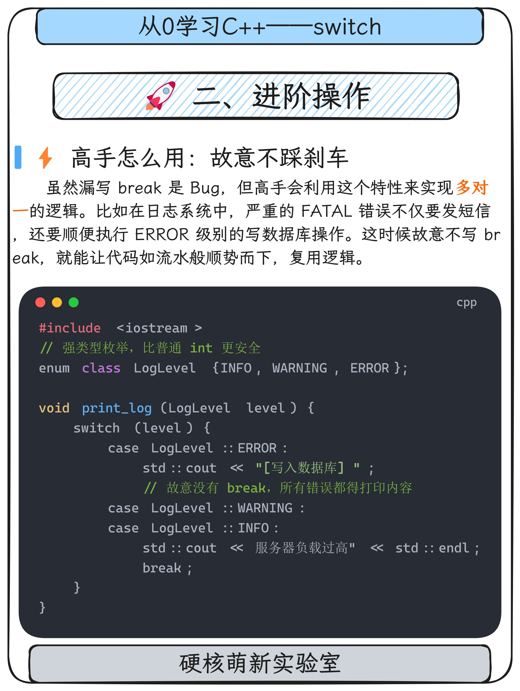
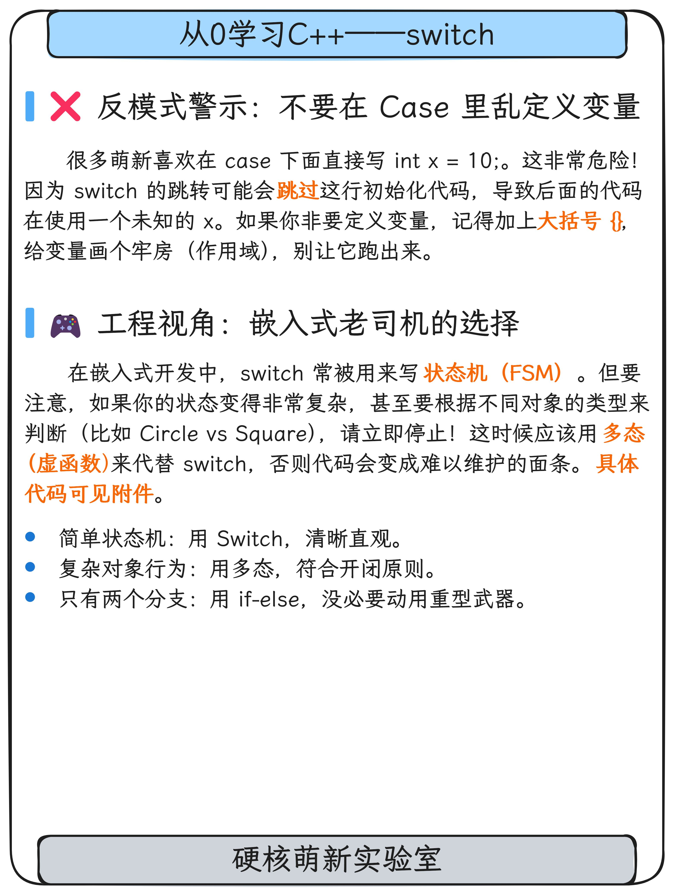
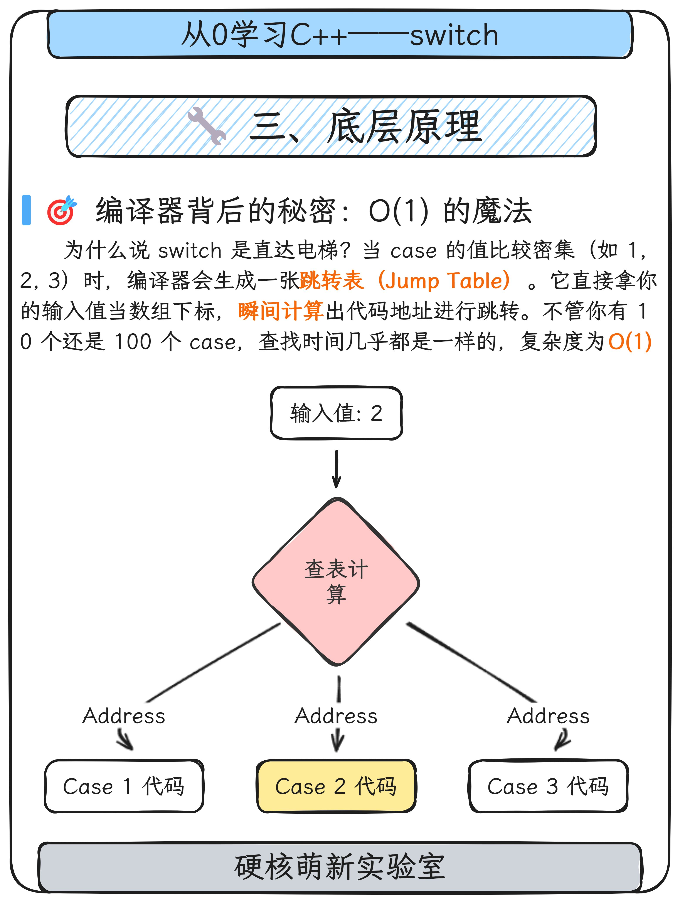
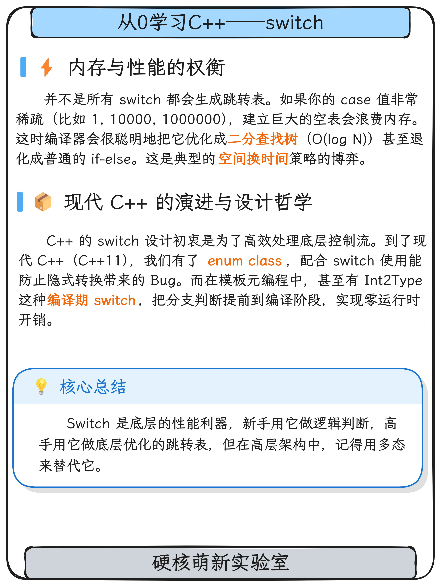

# C++ 学习笔记

这里是从0学习C++笔记的记录，整个文档可以克隆下来利用obsidian打开，目录详见[[从0学习C++目录.base]]，**持续更新中** ……。

## 📚 目录结构

本仓库使用Obsidian进行笔记管理,所有笔记文档存放在 `笔记/` 目录下。


## 🛠️ 使用方式

### 方式一: 使用Obsidian阅读

1. 下载并安装 [Obsidian](https://obsidian.md/)
2. 克隆本仓库到本地

```bash
git clone https://github.com/kuaile1407-byte/Cpp-Study-Notes.git
```

在Obsidian中打开此文件夹作为vault
即可享受双向链接、图谱视图等强大功能

### 方式二: 直接阅读Markdown文件

所有笔记都是标准的Markdown格式,可以使用任何Markdown编辑器或直接在GitHub上查看。

## 图文笔记

如果喜欢**图文**讲解，可以小红书/公众号搜索 `硬核萌新实验室`，形式如下：

<div align="center">
  
  
</div>

<div align="center">
  
  
</div>

<div align="center">
  
  
</div>

<div align="center">
  
</div>

## 🤝 贡献

欢迎各位大佬提交Issue和Pull Request来纠正完善这个学习笔记!